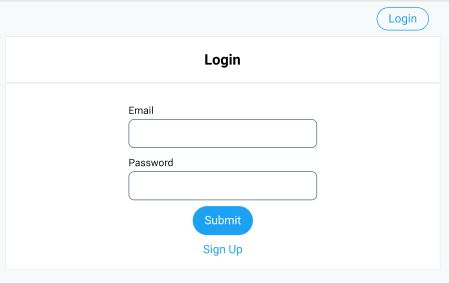
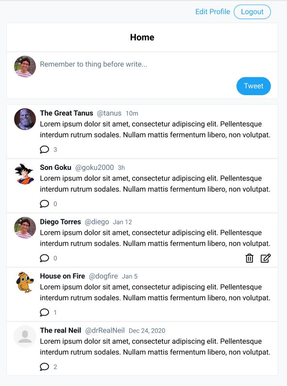
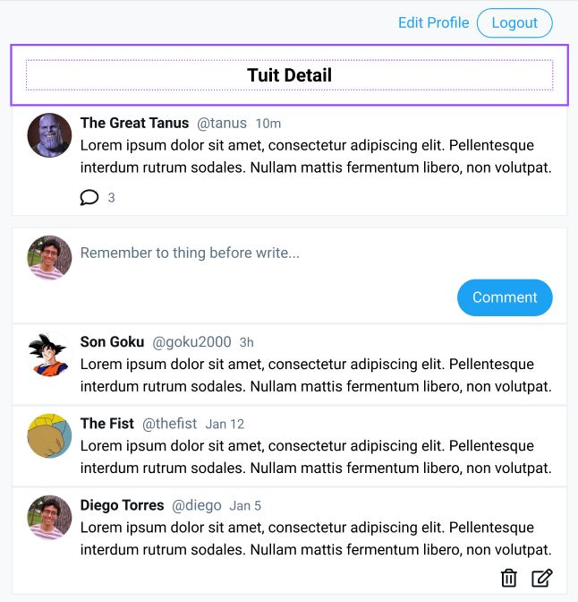

# Project: Tweetable

## Objective

Build the MVP of a simpler and modified version of `Twitter`

Login                       |  Main Page          
:-------------------------:|-------------------------:
  | 

Tweet Detail               |         
:-------------------------:|
  |

<!-- 

 -->

## Features:

- **Users can create an account**
- **Users can login to the app**
- **Users can logout**
- **Users can create a tweet**
- **Users can comment a tweet**
- **Users can mark a task as important**
- **Only users can delete their own tweet**
- **Everyone can see all the tweets**
- **Everyone can see a tweet and all the its comments**
